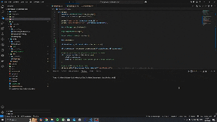

# Tupperware Desativados Bot



Um projeto de automação em Python que gera, a partir do portal da Tupperware, relatórios de consultores desativados e envia por e-mail, pensado para facilitar a rotina de consultoras líderes (como minha mãe).


## 📌 Motivação

Minha mãe, consultora líder na Tupperware, precisava manualmente baixar planilhas de consultores desativados, cruzar dados com o cadastro ativo e enviar o resultado para a Tupperware. Esse processo era repetitivo, consumia horas e estava sujeito a erros humanos. O **tupperware-desativados-bot** automatiza completa e com segurança:

* Login automático no portal
* Download da lista de desativados
* Processamento e cruzamento de dados
* Geração de relatório em PDF (com dados falsos para demonstrações)
* Envio de e-mail com anexo


## 🚀 Funcionalidades Principais

* **Automação Web**: Selenium + BotCity WebBot
* **Processamento de Dados**: Pandas para leitura de CSV/Excel e merge
* **Relatórios em PDF**: ReportLab com layout personalizável
* **Envio de E-mail**: BotCity Email Plugin para Gmail
* **Logging Robusto**: Loguru com rotação e retenção automáticas
* **Orquestração**: BotMaestroSDK para execução em diferentes ambientes


## 📂 Estrutura do Projeto

```
 tupperware-desativados-bot/
 ├─ downloads/                    # CSV baixado do portal
 ├─ logs/                         # arquivos de log gerados (Loguru)
 ├─ pdf/                          # relatórios gerados (ReportLab)
 ├─ uploads/                      # planilha de consultores ativos
 ├─ src/                          # código-fonte principal
 │  ├─ bot/                       # automação Web
 │  │  ├─ login_tupperware.py     # login automático no portal
 │  │  ├─ download_desativados.py # filtra ‘Desativado’ e baixa CSV
 │  │  └─ manager.py              # Singleton WebBot e configuração de ChromeDriver/downloads
 │  ├─ utils/                     # helpers de tratamento de dados e geração de PDF
 │  │  └─ helpers.py              # leitura, merge, regras de negócio,df_para_pdf
 │  ├─ mail/                      # integração de envio de e-mail
 │  │  └─ mail_google.py          # configura Gmail e envia email com anexo
 │  └─ main.py                    # orquestra flow completo (login → download → processar → PDF → e-mail)
 ├─ .env                          # variáveis de ambiente (credenciais e parâmetros)
 ├─ .env.example                  # exemplo de arquivo de ambiente
 ├─ .gitignore                    # arquivos/pastas ignorados no Git
 ├─ build.sh / build.bat / build.ps1  # scripts de setup multi-plataforma
 ├─ requirements.txt              # dependências Python
 ├─ README.md                     # documentação do projeto (este arquivo)
 └─ tupperware-desativados-bot.botproj  # definição de tarefa BotMaestroSDK
```


## ⚙️ Pré-requisitos

* Python 3.10 ou superior
* pip
* Google App Password gerado para envio de e-mail


## 🛠️ Instalação

1. Clone este repositório:

   ```bash
   git clone https://github.com/AdemarCastro/tupperware-desativados-bot
   cd tupperware-desativados-bot
   ```

2. Crie e ative um ambiente virtual (recomendado):

   ```bash
   python -m venv venv
   source venv/bin/activate   # Linux/macOS
   venv\Scripts\activate    # Windows
   ```

3. Instale as dependências:

   ```bash
   pip install -r requirements.txt
   ```

4. Copie e configure as variáveis de ambiente:

   ```bash
   cp .env.example .env
   ```

   Preencha em `.env`:

   ```dotenv
   USERNAME="seu_usuario"
   PASSWORD="sua_senha"
   EMAIL_USUARIO="seu_email@gmail.com"
   SENHA_USUARIO="senha_de_app_gerada"
   NOME_DESTINATARIO="Nome do Destinatário"
   EMAIL_DESTINATARIO="destino@exemplo.com"
   ASSUNTO="Relatório de Consultores Desativados"
   ANEXOS="pdf/dataframe.pdf"
   ```


## 🚀 Como Usar

Execute o entrypoint principal:

```bash
python src/main.py
```

O bot irá:

1. Fazer login no portal da Tupperware
2. Filtrar e baixar a lista de consultores desativados
3. Processar os arquivos (`downloads/` + `uploads/`)
4. Gerar relatório PDF em `pdf/dataframe.pdf`
5. Enviar o PDF por e-mail para os destinatários configurados


## 📝 Exemplos de Código

### Singleton Manager (`src/bot/manager.py`)

```python
from webdriver_manager.chrome import ChromeDriverManager
from botcity.web.browsers.chrome import default_options
from botcity.web import WebBot
import os

class Manager:
    _instance = None

    @staticmethod
    # Utilizando o PP Singleton para garantir uma única instância do BotCity Web em toda a aplicação
    def get_instance():
        if Manager._instance is None:
            bot = WebBot()
            bot.headless = False
            download_folder = os.path.join(os.getcwd(), 'downloads')
            os.makedirs(download_folder, exist_ok=True)

            opts = default_options(headless=bot.headless,
                                   download_folder_path=download_folder)
            bot.driver_path = ChromeDriverManager().install()
            bot.options = opts
            Manager._instance = bot
        return Manager._instance
```

### Helpers de Dados (`src/utils/helpers.py`)

```python
def ler_arquivos():
    # busca CSV mais recente em downloads e XLS(X) em uploads, retorna dois DataFrames

def encontrar_interseccao(df_des, df_cad):
    # merge por 'Nome', combina telefones e aplica regras de negócio

def df_para_pdf(df, nome_pdf='dataframe.pdf'):
    # monta PDF estilizado em A4 com ReportLab
```

### Envio de E-mail (`src/mail/mail_google.py`)

```python
from botcity.plugins.email import BotEmailPlugin, MailServers
import os

class MailGoogle:
    def __init__(self):
        email = os.getenv('EMAIL_USUARIO')
        pwd = os.getenv('SENHA_USUARIO')
        self.mail = BotEmailPlugin.config_email(MailServers.GMAIL, email, pwd)

    def enviar_email(self, dests, subject, body, attachments):
        self.mail.send_message(subject, body, dests, attachments=attachments)
        self.mail.disconnect()
```


## 🛡️ Segurança & Dados Sensíveis

* Algumas partes do gif de demonstração estão censuradas (credenciais, telas sensíveis).
* O PDF mostrado usa **dados fake** gerados a partir dos originais, protegendo informações reais.


## 🤝 Contribuições

1. Fork este repositório
2. Crie uma branch: `git checkout -b feature/nova-funcionalidade`
3. Faça seus commits: `git commit -m "[FEAT] Descrição da mudança"`
4. Envie para o repositório remoto: `git push origin feature/nova-funcionalidade`
5. Abra um Pull Request


## 📄 Licença

Este projeto está sob a licença MIT. Veja o arquivo [LICENSE](LICENSE) para mais detalhes.